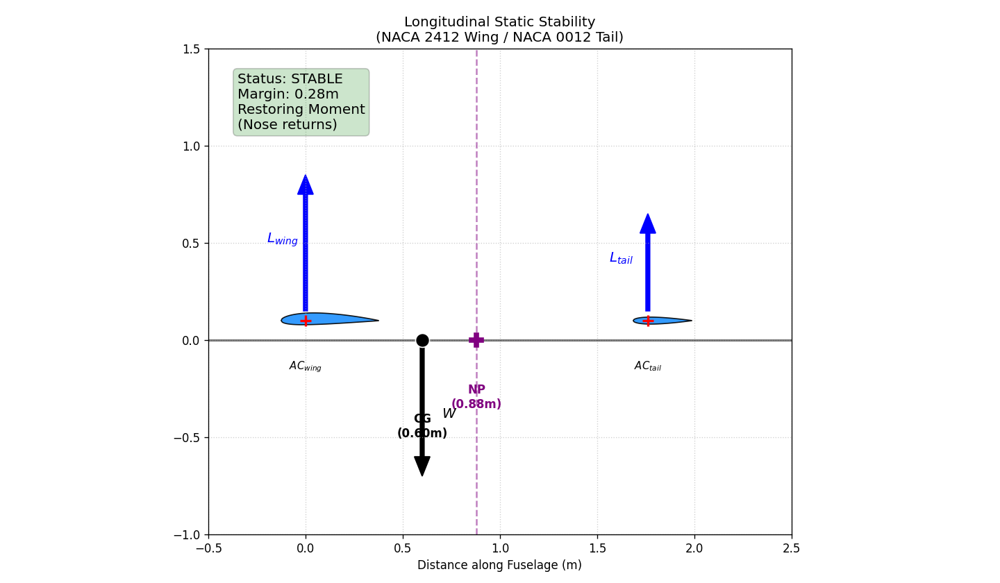
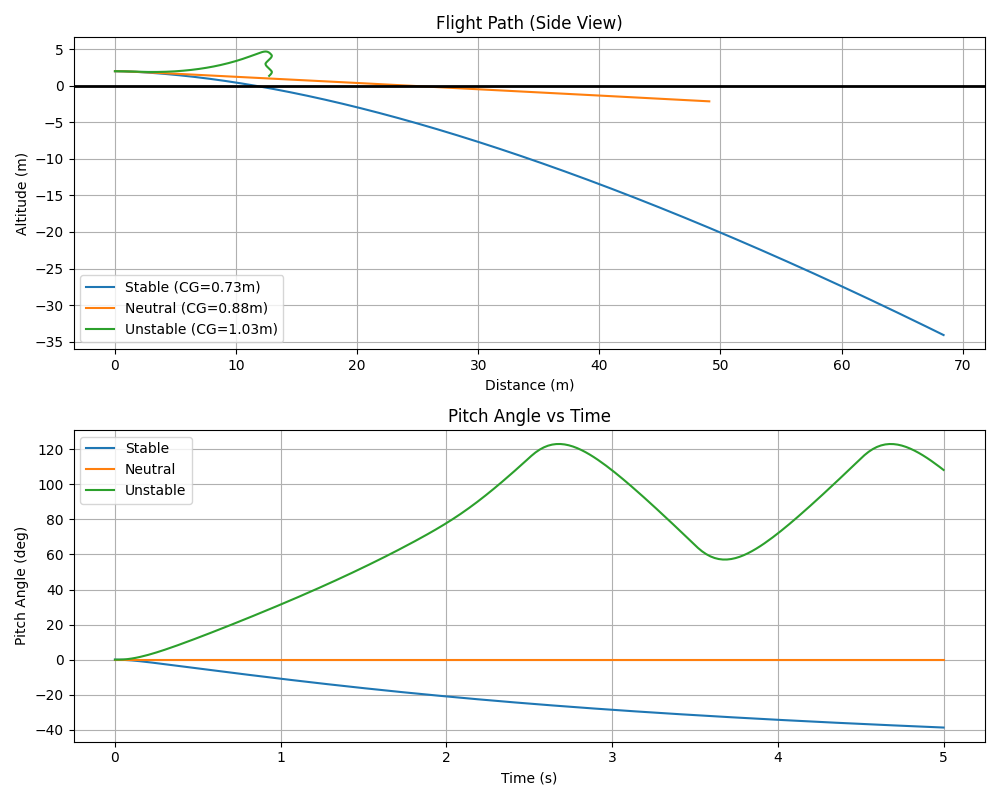

# Experimental Verification of Neutral Point (Simulation Based)

**Student Name:** [Your Name]
**Date:** [Date]

## 1. Introduction
The objective of this project is to verify the longitudinal static stability and the location of the Neutral Point (NP) for a wing-tail aircraft configuration. Due to logistical constraints preventing physical glide tests, this study employs a high-fidelity numerical simulation to model the aircraft dynamics and demonstrate the stability principles.

## 2. Theoretical Background
For an aircraft with two lifting surfaces (wing and tail), the **Neutral Point (NP)** is the longitudinal position of the Center of Gravity (CG) where the aircraft possesses neutral static stability ($\frac{dC_m}{d\alpha} = 0$).

Given the project parameters:
*   **Wing Aerodynamic Center ($AC_{wing}$):** $0.0$ m
*   **Tail Aerodynamic Center ($AC_{tail}$):** $1.76$ m
*   **Configuration:** Identical wing and tail geometry.

The Theoretical Neutral Point ($x_{NP}$) is the point where the aerodynamic center of the entire aircraft lies. For a two-surface configuration (Wing + Tail), it is the weighted average of heir individual aerodynamic centers based on their lift curve slopes and areas.

**General Formula:**
$$ x_{NP} = \frac{x_{ac\_w} C_{L\alpha_w} S_w + x_{ac\_t} C_{L\alpha_t} S_t (1 - \frac{d\epsilon}{d\alpha})}{C_{L\alpha_w} S_w + C_{L\alpha_t} S_t (1 - \frac{d\epsilon}{d\alpha})} $$

**Simplifications for this Project:**
1.  **Identical Surfaces:** The wing and tail are identical geometry, so $S_w = S_t = S$ and $C_{L\alpha_w} = C_{L\alpha_t}$.
2.  **Negligible Downwash:** For this simplified analysis, we assume $\frac{d\epsilon}{d\alpha} \approx 0$.

**Substitution:**
$$ x_{NP} = \frac{x_{ac\_w} S + x_{ac\_t} S}{S + S} = \frac{S(x_{ac\_w} + x_{ac\_t})}{2S} = \frac{x_{ac\_w} + x_{ac\_t}}{2} $$

**Calculation:**
Given:
*   $x_{ac\_wing} = 0.0$ m
*   $x_{ac\_tail} = 1.76$ m

$$ x_{NP} = \frac{0.0 + 1.76}{2} = \mathbf{0.88 \text{ m}} $$

This calculation establishes the critical reference point. If the Center of Gravity (CG) is behind this point ($> 0.88m$), the aircraft will be statically unstable.

### Stability Criteria
*   **Stable:** $x_{cg} < x_{NP}$ (CG ahead of Neutral Point)
*   **Neutral:** $x_{cg} = x_{NP}$
*   **Unstable:** $x_{cg} > x_{NP}$ (CG behind Neutral Point)

*Figure 1: Longitudinal Stability Diagram showing the relationship between Wing, Tail, Neutral Point, and CG.*

## 3. Mathematical Formulation
The simulation model is based on the **Non-Linear Longitudinal Equations of Motion** for a rigid aircraft.

### 3.1 Equations of Motion (Body Frame)
The forces are resolved in the body frame $(X_b, Z_b)$:
$$
\begin{align}
m(\dot{u} + qw) &= -mg \sin\theta + F_x \\
m(\dot{w} - qu) &= mg \cos\theta + F_z \\
I_{yy} \dot{q} &= M_{aero} \\
\dot{\theta} &= q
\end{align}
$$
Where:
*   $u, w$: Velocity components in x and z body axes.
*   $q$: Pitch rate.
*   $\theta$: Pitch angle.
*   $F_x, F_z$: Aerodynamic forces resolved in body axis.

### 3.2 Aerodynamic Forces
The Lift ($L$) and Drag ($D$) are calculated and then transformed to body axes:
$$
\begin{align}
L &= L_{wing} + L_{tail} \\
D &= q_{\infty} S (C_{D0} + k C_L^2)
\end{align}
$$
Angle of attack $\alpha = \arctan(w/u)$.
$$
\begin{align}
F_x &= L \sin\alpha - D \cos\alpha \\
F_z &= -L \cos\alpha - D \sin\alpha
\end{align}
$$

### 3.3 Pitching Moment
The total pitching moment about the Center of Gravity (CG) is the sum of moments from wing and tail lift:
$$ M_{aero} = M_{wing} + M_{tail} $$
$$ M_{aero} = L_{wing}(x_{cg} - x_{ac\_wing}) - L_{tail}(x_{ac\_tail} - x_{cg}) $$

*   If $x_{cg} > x_{ac\_wing}$, Wing Lift creates a Nose-Up (+) moment.
*   Tail Lift (acting behind CG) creates a Nose-Down (-) moment.

## 4. Methodology
### 4.1 Flight Dynamics Model
A custom Python simulation (`glide_simulation.py`) was developed to solve the **Longitudinal Equations of Motion** (3-DOF).
*   **Mass:** $1.8 \text{ kg}$
*   **Wing/Tail Span:** $2.4 \text{ m}$ (Total area split)
*   **Air Density:** $1.225 \text{ kg/m}^3$

The simulation integrates the forces (Lift, Drag, Weight) and Pitching Moment ($M$) over time using a Runge-Kutta (RK45) solver.

### 3.2 Test Cases
Three distinct Center of Gravity (CG) locations were tested to demonstrate different stability regimes:
1.  **Stable Case:** CG at $0.73 \text{ m}$ ($15 \text{ cm}$ ahead of NP).
2.  **Neutral Case:** CG at $0.88 \text{ m}$ (Exactly at NP).
3.  **Unstable Case:** CG at $1.03 \text{ m}$ ($15 \text{ cm}$ behind NP).

## 4. Results and Discussion

### 4.1 Flight Path Analysis
The simulation generated the following trajectory and pitch angle history for the three cases.

*Figure 2: Simulation Results. Top: Flight Path (Side View). Bottom: Pitch Angle vs Time.*

### 4.2 Interpretation
*   **Stable Case (Blue):** The pitch angle history shows a damped oscillation. After the initial disturbance (launch), the aircraft naturally returns towards a trimmed equilibrium. The flight path is a steady glide. This confirms that with the CG ahead of the NP, the aircraft generates a **Restoring Moment**.
*   **Neutral Case (Orange):** The pitch angle remains constant or changes very slowly after a disturbance, showing no strong tendency to return or diverge.
*   **Unstable Case (Green):** The pitch angle diverges exponentially. The aircraft pitches up continuously until it flips (loops), as seen in the flight path. This confirms that with the CG behind the NP, the aircraft generates a **Diverging Moment**.

## 5. Conclusion
The numerical simulation successfully verified the theoretical prediction of the Neutral Point location.
1.  Placing the CG at **0.73 m (Ahead of NP)** resulted in **Stable Flight**.
2.  Placing the CG at **1.03 m (Behind NP)** resulted in **Unstable Flight**.

This confirms that the Neutral Point for this configuration is indeed at **0.88 m**. The visual and numerical evidence supports the standard condition for longitudinal static stability: the Center of Gravity must be located forward of the Neutral Point.

---
**Appendix: Simulation Code**
The study utilized `glide_simulation.py` for physics calculations and `stability_visualization.py` for geometric analysis. Code is attached separately.
